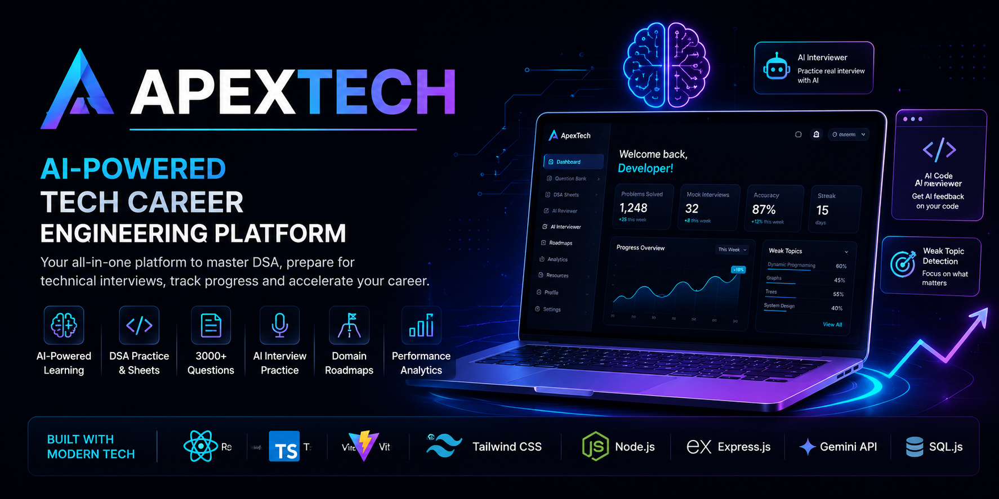

<div align="center">



# 🚀 ApexTech

### AI-Powered Learning and Interview Preparation Platform

A modern platform for DSA, AI-powered interview preparation, technical learning, roadmaps, and performance analytics.

### 🌐 Live Demo

🚀 **Try ApexTech:** https://apextechh.onrender.com

</div>

---

# 📖 Overview

📖 Overview

ApexTech is a centralized platform designed to simplify technical learning, DSA practice, interview preparation, and career development.

It combines AI-powered tools, structured learning roadmaps, performance analytics, and technical resources into a single ecosystem to help developers improve their skills and prepare for real-world opportunities.

---

✨ Features
🔐 User Experience
Secure Authentication
Personalized Developer Dashboard
Developer Profile
Settings Management
💻 Learning & Practice
Technical Interview Question Bank
Curated DSA Sheets
Domain-Based Roadmaps
Learning Resources
🤖 AI-Powered Features
AI Code Reviewer
AI Technical Interviewer
Smart Learning Assistance
Personalized Recommendations
📊 Analytics & Growth
Performance Analytics
Weak Topic Analysis
Learning Progress Tracking
---

# 🛠️ Tech Stack

| Category | Technology |
|----------|------------|
| Frontend | React, TypeScript, Vite |
| Styling | Tailwind CSS |
| Backend | Node.js, Express.js |
| AI | Google Gemini API |
| Database | SQL.js |

---

# 📂 Project Structure

```text
ApexTech
│
├── assets/
├── src/
│   ├── components/
│   ├── pages/
│   ├── data/
│   ├── db/
│   ├── utils/
│   ├── App.tsx
│   └── main.tsx
│
├── .env.example
├── package.json
├── server.ts
├── vite.config.ts
└── README.md
```

---

# 🚀 Getting Started

## Prerequisites

- Node.js
- npm

## Installation

```bash
git clone https://github.com/ashwanirai-06/ApexTech.git

cd ApexTech

npm install
```

## Environment Variables

Create a `.env.local` file and add your Gemini API key.

```env
GEMINI_API_KEY=YOUR_GEMINI_API_KEY
```

## Run the Project`

Start the development server:

npm run dev

After the server starts, open the local URL displayed in your terminal.

# 👨‍💻 Team Members

| Name           | Role                                                             |
| -------------- | ---------------------------------------------------------------- |
| Ashwani Rai    | Project Lead, Full-Stack Development, AI Integration, Deployment |
| Abhinav Gupta  | UI Design, Testing, Documentation                                |
| Aditya Gangwar | Research, Content Management, Question Bank Management           |
| Abhishek Kumar | Quality Assurance, Resource Management, Presentation             |

---

# 🤖 AI Integration

This project utilizes Google Gemini to provide intelligent features, including:

* AI-powered code review
* AI-based viva sessions
* Personalized recommendations
* Smart learning assistance
* Intelligent performance analysis

---

# 🤝 Contributions

Contributions, suggestions, and feedback are always welcome.

Feel free to fork the repository and submit a pull request.

---

# ⭐ Support

If you found this project helpful, consider giving it a star.
